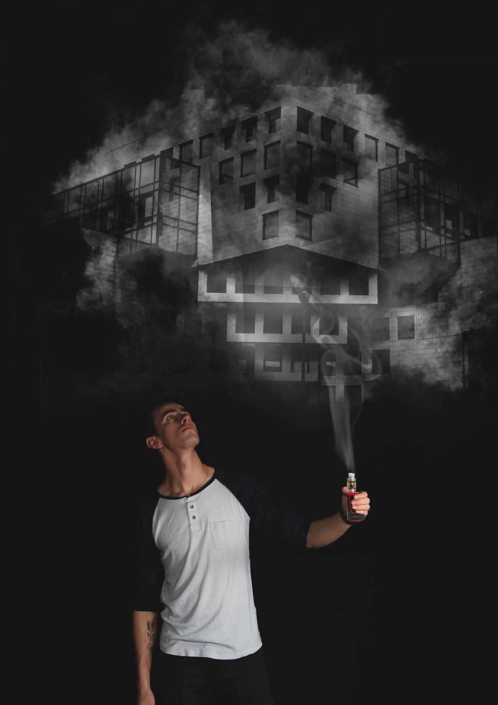

>Project : Photomontage 
>Subject : Design of a photo montage and control of the photography in the studio 
>Author : Donaël Walter  
>Tools : Canon EOS, Photoshop CC 
----------------------------------------------------------
## NOTE OF INTENT :
  
### Photomontage.

When designing the photos in the studio, my first idea was to mix the past, the present
and the future. That's why my first portrait photo referred to the past, my object to the
and my photo of the environment in the future. Unfortunately, in trying to bring these three together
independently designed photos, I realized that she didn't fit together and that
the photomontage exercise will be difficult. That's when I decided to redo the picture of
portrait and thus to make my idea evolve.

In my current photomontage, I wanted to bring a fantastic side to the picture by doing
a world appears through the smoke generated by the electronic cigarette. The object here becomes as
a magical object capable of opening parallel worlds. He can remind us of Aladdin's lamp.
to make things appear. Here the model can only observe this world through this
smoke because, the smoke remains something fragile. Any attempt to seize this world would only
make it disappear. The character is therefore a prisoner of his world and has only the power to
to look at the world through the smoke.

  

**THE FINAL PRODUCTION :**

