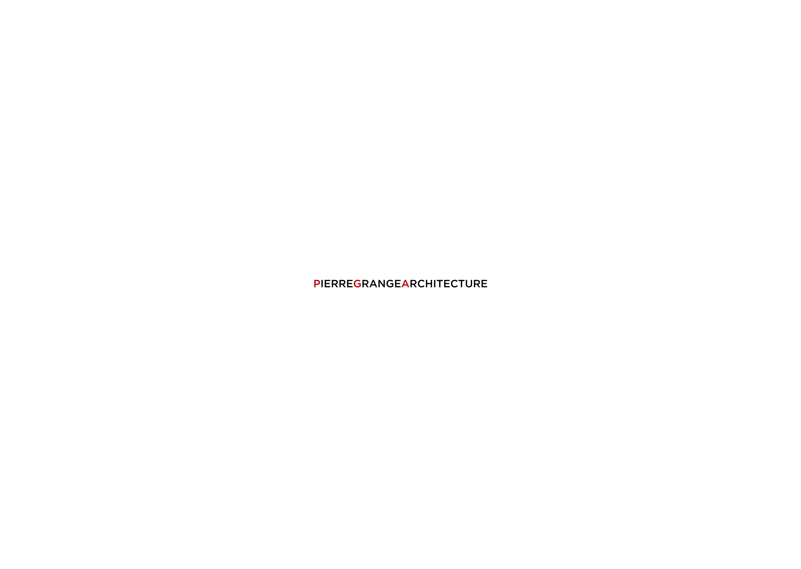

> Project : Pierre Grange Architecte  
> Type : UI/UX Design  
> Author : Donaël Walter, Axel Dos Santos, Brice Girard 
> My rôle : Développeur Web , UI/UX Designer, Directeur Artistique et Chef de projet.  Outils : Figma, Wordpress

    Pierre Grange is a young Dijon/Auxerois architect, who called on our studio to design a visual identity and portfolio for this work.
    With the constraint of providing everything at the end of the project, and giving him the ability to manage his own content.

  

## UI

  

  

  

  

Pierre Grange Architecte Website : <a target='_blanck' href="https://pierregrangearchitecte.fr/"> click here </a>
