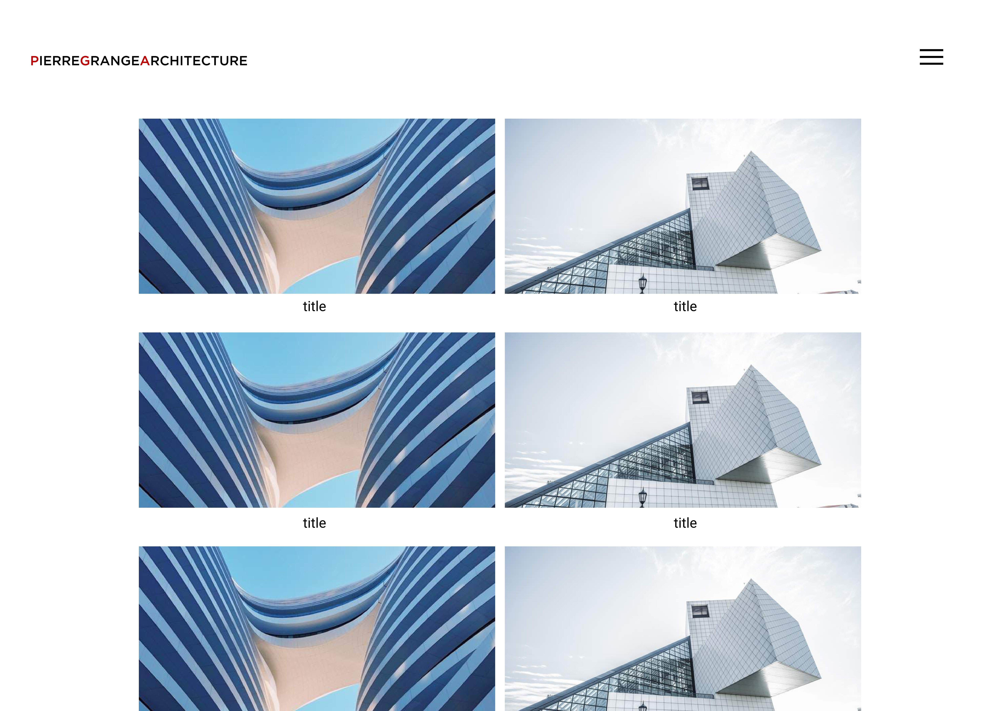
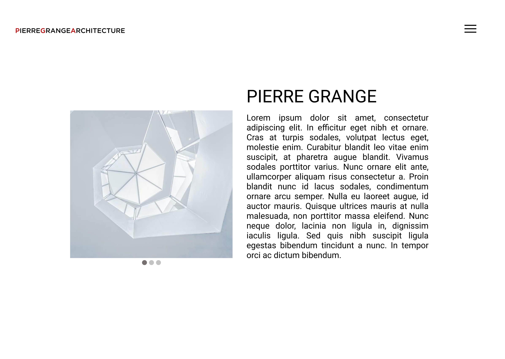
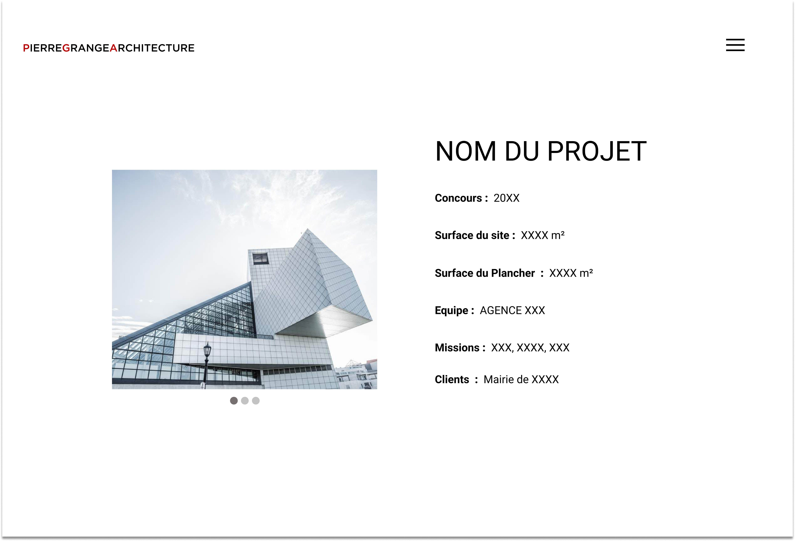
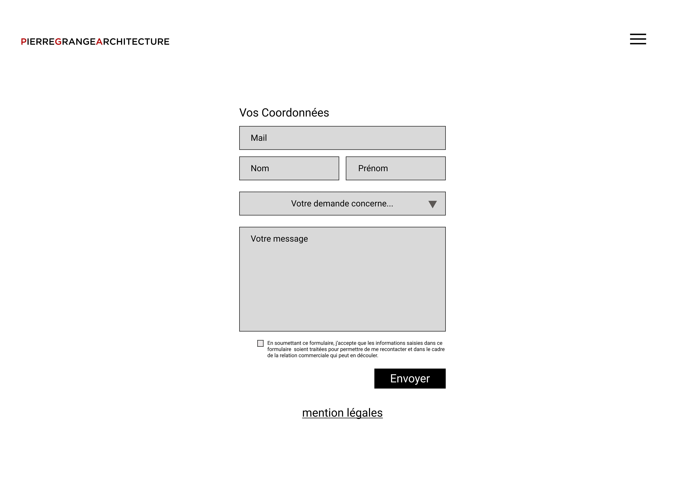

>Projet : Pierre Grange Architecte  
>Type : UI/UX Design  
>Auteur : Donaël Walter, Axel Dos Santos, Brice Girard 
>Mon rôle : Développeur Web , UI/UX Designer, Directeur Artistique et Chef de projet.  
>Outils : Figma, Wordpress
----------------------------------------------------------

Pierre Grange est un jeune architecte Dijonais/Auxerois, qui a fait appel à notre studio, pour lui concevoir une identité visuelle et un portfolio de ces travaux.
Avec pour contrainte de tout lui fournir à la fin du projet, et de lui donner les capacités de gérer sont propre contenue.

  

Expertise :
  
Architecture moderne, calcul de fondation, plan de rénovation, Intérieur appartement, aménagement petite salle de bains, aménagement sous sol, Construction d'extension de maison et surélévation, construction d'extension, constructions d'extensions, Maîtrise d'ouvrage, missions de maîtrise d'ouvrage, missions de gestion de chantier, Architecture moderne, calcul de fondation, plan de rénovation.

  

## UI

  

  

  

  

Pierre Grange Architecte Website : <a target='_blanck' href="https://pierregrangearchitecte.fr/"> cliquez ici </a>
