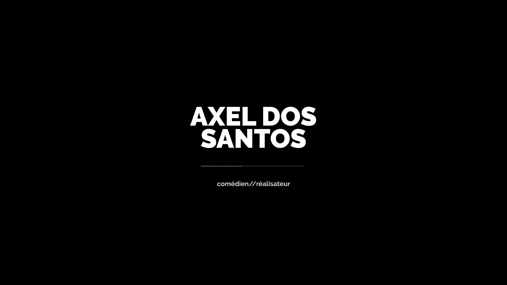
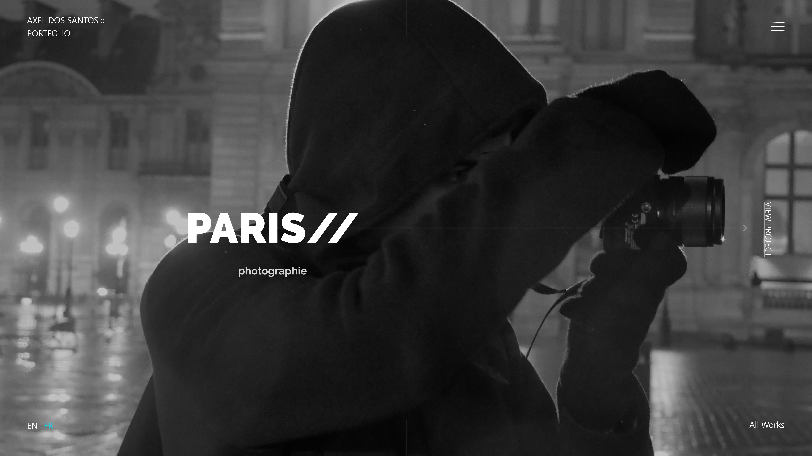
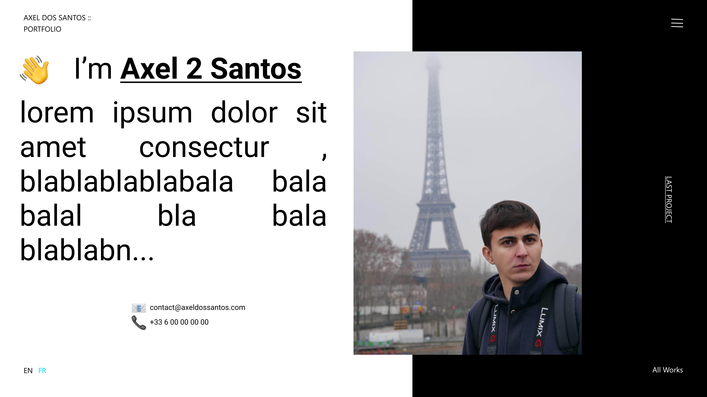
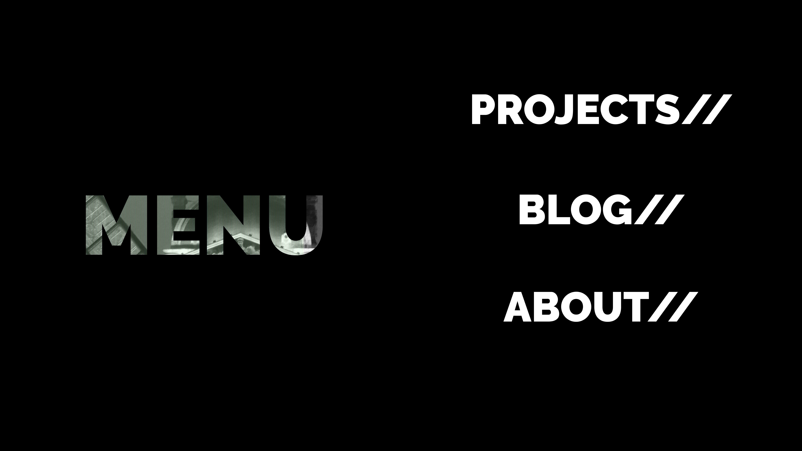

> Project : Portfolio Axel Dos Santos  
> Type : UI/UX Design  
> Author : Donaël Walter Outils : Figma, React

  In order to discover the graphic design software Figma, I suggested to a classmate to think about his portfolio. Here are the models I made when I first used Figma.

  Axel Dos Santos is a person with whom I have studied for the last two years at the IUT in Dijon, it is in his company that I have worked a lot on photography and image. He is currently in film school in Paris. 

## First models

  

  

  

  

  

  

I started working on the development of his site using the same technologies as my own portfolio, i.e. GatsbyJS and React. In case Axel would like to become independent, I will work more seriously on his portfolio, especially in terms of UX Design.

For the moment here are his instagram: <a href="https://www.instagram.com/axe2santos/" target="blanck"><b>https://www.instagram.com/axe2santos/</b></a>