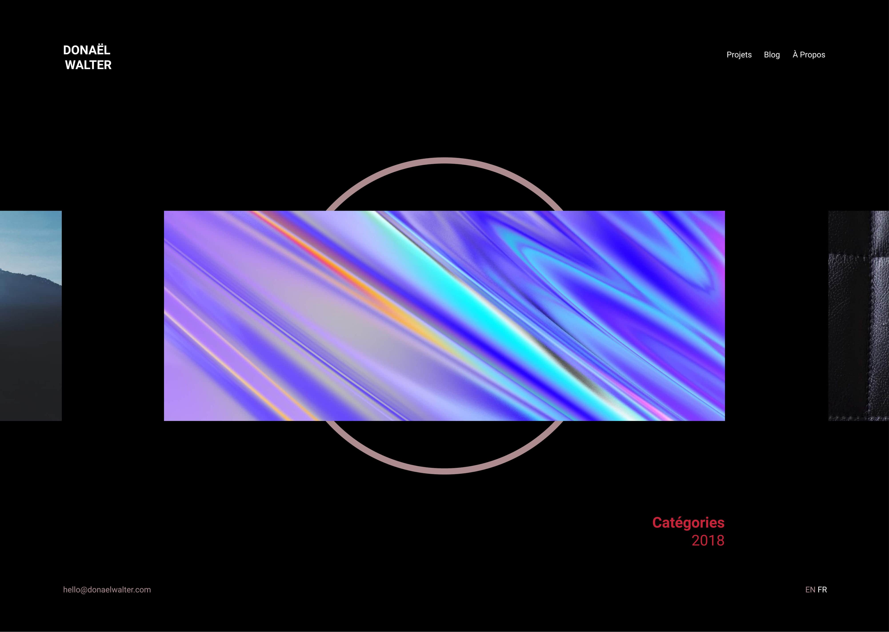
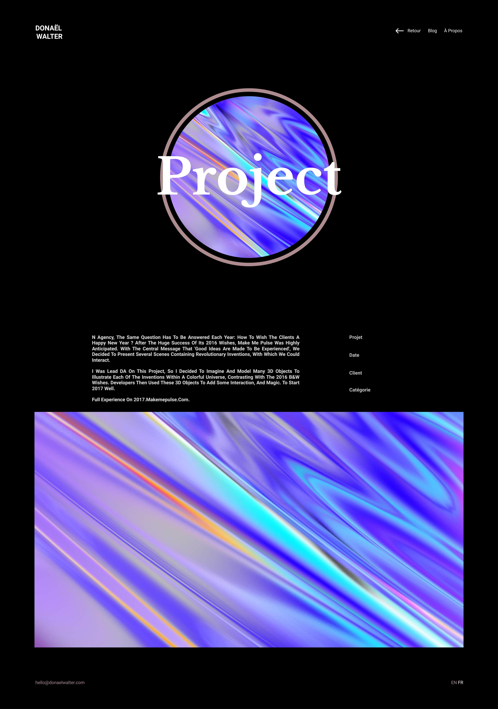

>Project : Portfolio V3  
>Type : UI/UX Design  
>Author : Donaël Walter 
>Tools : Figma, React
----------------------------------------------------------

  The portfolio is one of the best and most difficult exercises for any creative person, it requires getting to know oneself, taking a step back on oneself, one's life and one's projects, and because we are in constant evolution, the portfolio too must evolve.

## First models

  

|  |  |
|:------------:|:-------------:|
|       black version  |       white version     |
  

  

  

## Situational analysis and evolution
  

<video style="width:100%" controls="false" poster="./featured-image.jpg" autoplay loop >
  <source src="./test-video.mp4"></source>
</video>

  
  

Portfolio v1 : <a target='_blanck' href="https://portfoliov1.donaelwalter.com/"><b> click here </b></a>
  
Portfolio v2 : <a target='_blanck' href="https://portfoliov2.donaelwalter.com/"> <b>click here</b> </a>
