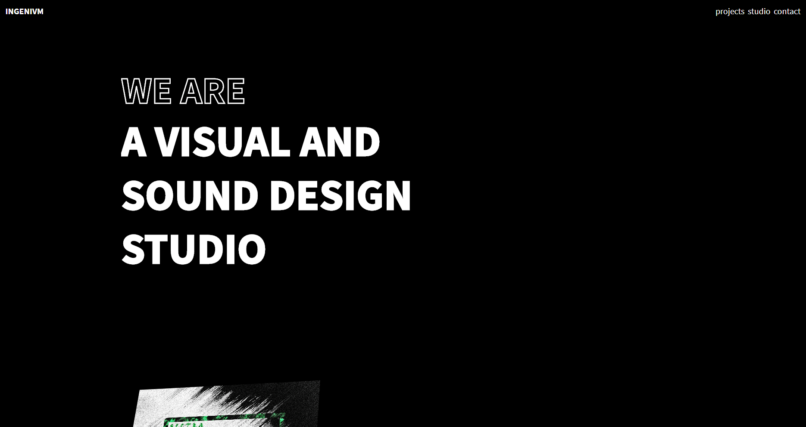
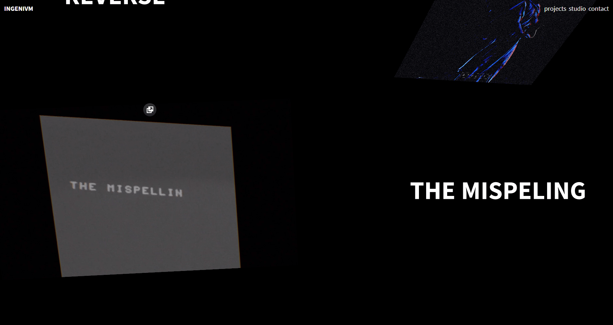
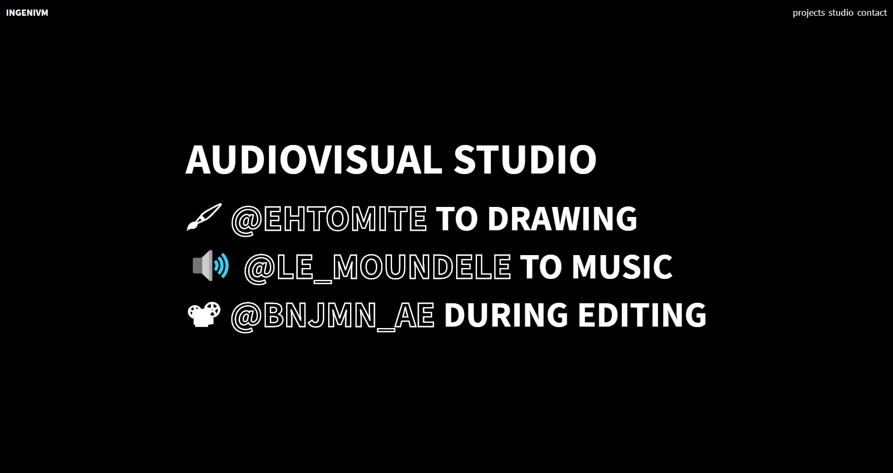

> Project : Portfolio INGENIVM  
> Type : UI/UX Design  
> Author : Donaël Walter 
> Outils : Figma, VueJS

  INGENIVM is a group of three creative people who studied with me for two years. They do motion design, graphic design and music. 
  The group is composed of:  

  - Benjamin Gay 
  - Timothée Robert 
  - Charlie Jannet

## The Project

  

  

  

  

I designed this site mainly to test tools and build skills.  
For the design I used mainly the Figma software.  
And for the development  of the site I used Nuxt and VueJS .  
This is the first project I have done with VueJs 

You can try the site here : <a href="https://ingenium-portfolio.netlify.com" target="_blanck"><b>INGENIVM PORTFOLIO</b></a>

Be careful this site is not perfect, I plan to work on it again in the future. 
If you want, you can tell me your opinion !