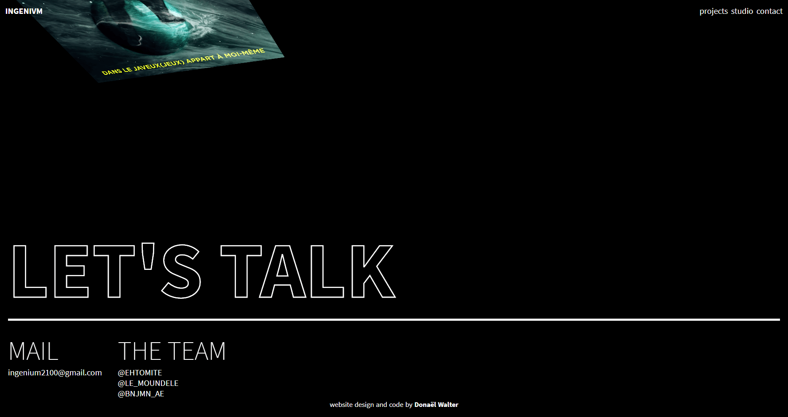
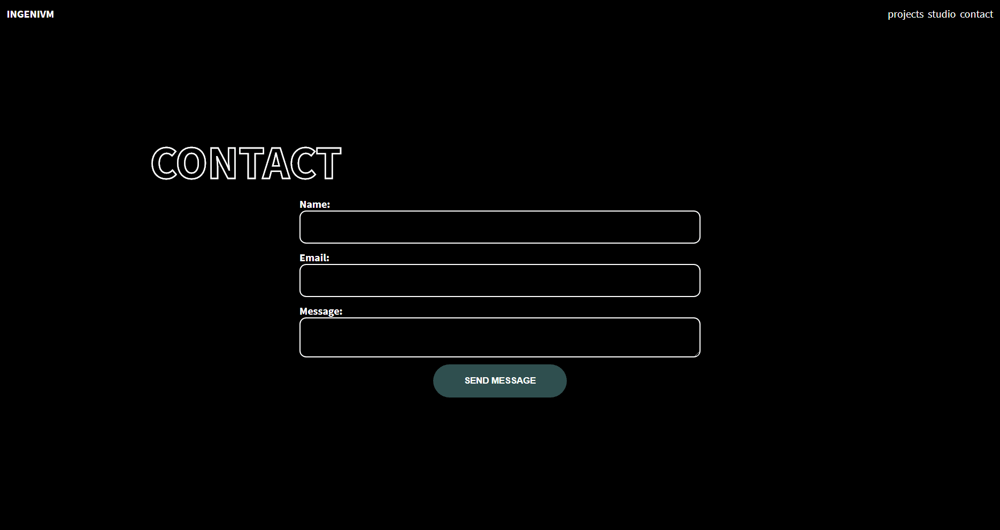

> Project : Portfolio INGENIVM  
> Type : UI/UX Design  
> Author : Donaël Walter 
> Outils : Figma, VueJS

  In order to improve my skills, I have decided to make the INGNIVM portfolio.

## The Project

  

  

  

  
