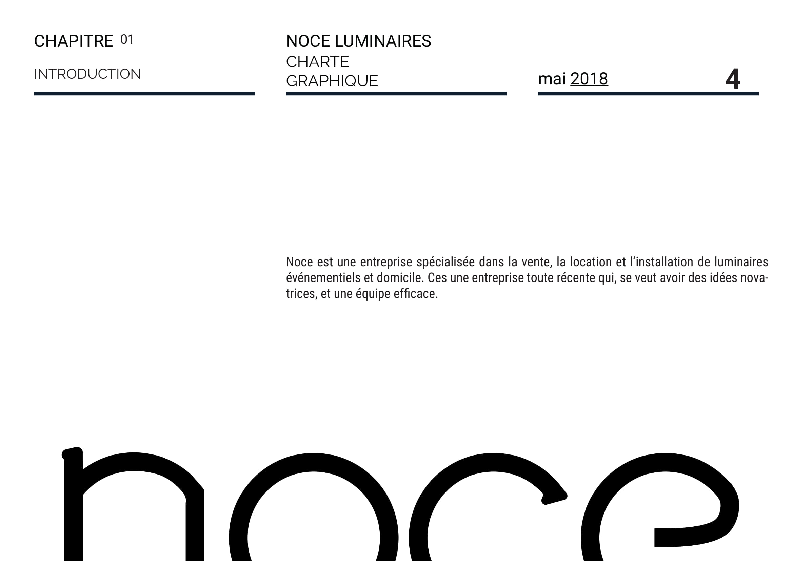
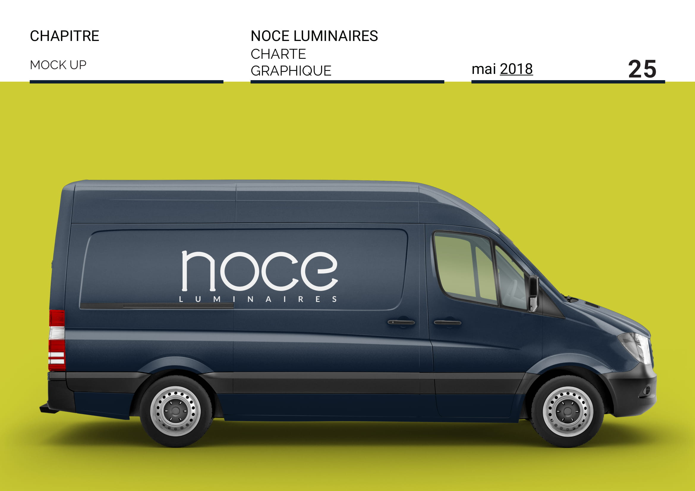

>Project : Noce Luminaire 
>Subject : Creation of a visual identity 
>Author : Donaël Walter  
>Tools : Adobe Photoshop CC, Adobe Indesign CC, Adobe Illustrator CC 
----------------------------------------------------------

    Noce is a fictional company that sells lighting fixtures for individuals and music professionals. 

Below is the first graphic charter that I designed from A to Z, starting from the company logo and including typography to the design of documents.  

In carrying out this project I learned a lot from the study of competitors to the choice of a subject, and the creation of a real identity that makes sense.   

Creating an identity is one of the most interesting things I find to do.

## My rendering

  

  

  

  

  

  

  

  

  

  

  

  

  

  

  

  

  

  

  

  

  

  

  

  

  

  

